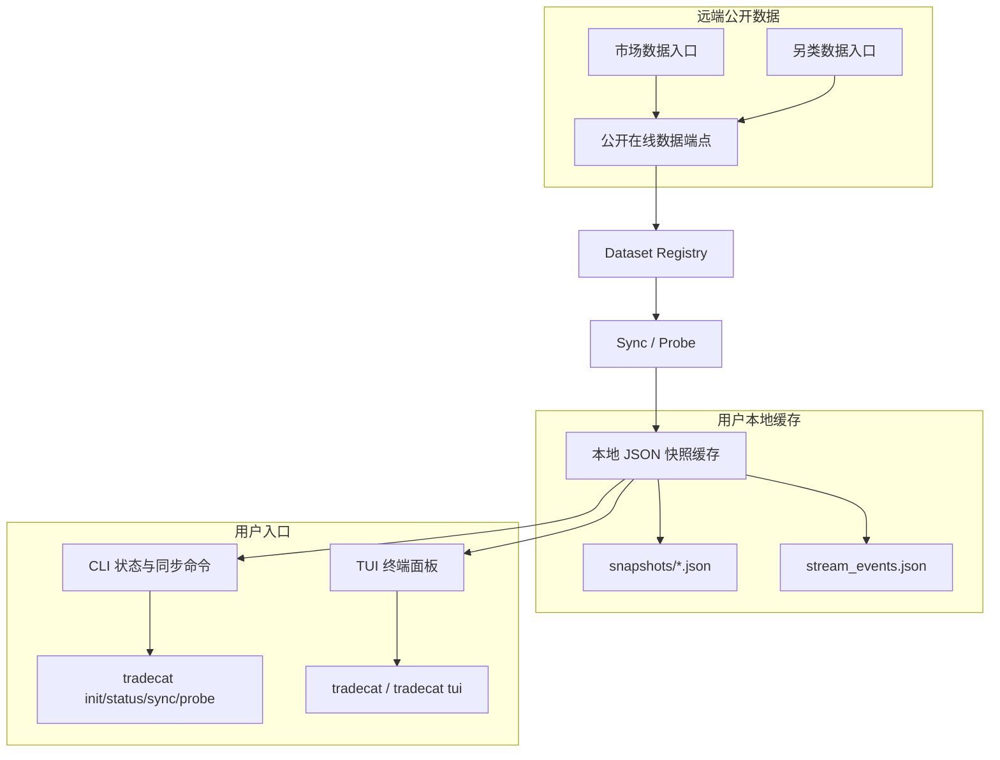

<div align="center">

# TradeCat

用户侧终端面板：只读 TradeCat 公开数据入口，写入本地 JSON 快照缓存，并在终端中浏览市场快照与事件流。

[](https://github.com/tukuaiai/tradecat/actions/workflows/ci.yml)
[](https://www.python.org/)
[](LICENSE)

CA：[DexScreener](https://dexscreener.com/bsc/0x8a99b8d53eff6bc331af529af74ad267f3167777)

公开数据入口：
由内置 dataset registry 管理，用户无需手工配置数据源。

社区：
[Telegram](https://t.me/tradecat_community) /
[GitHub](https://github.com/tukuaiai/tradecat)

</div>

---

## 目录

- [定位](#定位)
- [系统架构图](#系统架构图)
- [免责声明](#免责声明)
- [快速开始](#快速开始)
- [一次性请求](#一次性请求)
- [常用命令](#常用命令)
- [TUI 操作](#tui-操作)
- [数据集](#数据集)
- [缓存结构](#缓存结构)
- [配置](#配置)
- [开发与验证](#开发与验证)

> 给 AI 助手的一句话：`请按 https://github.com/tukuaiai/tradecat/tree/develop 的 README 帮我安装并运行 TradeCat。`

## 定位

TradeCat 是一个轻量、可本地运行、可独立分发的用户侧工具。

它只做三件事：

1. 从公开在线数据端点读取数据。
2. 把最新内容保存为用户本地 JSON 快照缓存。
3. 用 CLI / TUI 在终端里查看市场快照和事件流。

它明确不做这些事：

- 不连接或写入 TradeCat 服务端 PostgreSQL。
- 不使用 SQLite、WAL、本地 SQL 查询层或数据库型后端存储。
- 不需要云端服务账号、私钥、token 或服务端权限。
- 不承担服务端数据生产、采集、修复或发布职责。

## 系统架构图



## 免责声明

1. 本项目仅用于技术研究、数据浏览与社区协作交流，不构成投资建议、理财建议或交易建议。
2. 本项目不隶属于任何交易所、基金、做市商或官方组织。
3. 数字资产价格波动剧烈，可能出现大幅亏损甚至归零风险，请自行评估风险并独立决策。
4. 本工具只读取公开在线数据源，不保证第三方数据源、网络、外部数据承载服务、交易所页面或外部链接持续可用。
5. 项目维护者和贡献者不对任何直接或间接损失承担责任，包括但不限于投资亏损、交易损失、第三方服务故障、误用数据或链接跳转风险。

## 快速开始

### 推荐：一键安装

Linux / macOS / WSL / Git Bash：

```bash
curl -fsSL https://raw.githubusercontent.com/tukuaiai/tradecat/develop/install.sh | sh
tradecat
```

Windows PowerShell：

```powershell
irm https://raw.githubusercontent.com/tukuaiai/tradecat/develop/install.ps1 | iex
tradecat
```

安装脚本会自动完成：

1. 克隆或更新 `https://github.com/tukuaiai/tradecat.git` 的 `develop` 分支。
2. 创建项目内 `.venv`。
3. 安装 `tradecat` 命令入口。
4. 初始化 `.tradecat/cache`。
5. 尝试同步一次公开数据，失败时不阻断安装。
6. 把 `tradecat` / `tcat` / `tradecat-uninstall` 放到用户级命令目录。
7. Linux / macOS / WSL 会把命令目录写入 shell profile；当前会话如果还没生效，可直接运行 `~/.local/bin/tradecat`。

### 卸载

安装完成后，直接运行：

```bash
tradecat-uninstall
```

Windows PowerShell：

```powershell
tradecat-uninstall
```

也可以不依赖本地安装，直接远程卸载默认安装位置：

```bash
curl -fsSL https://raw.githubusercontent.com/tukuaiai/tradecat/develop/uninstall.sh | sh
```

Windows PowerShell：

```powershell
irm https://raw.githubusercontent.com/tukuaiai/tradecat/develop/uninstall.ps1 | iex
```

卸载会删除：

- TradeCat 安装目录。
- `tradecat` / `tcat` / `tradecat-uninstall` 命令入口。
- 后台 watch 的 pid/log 运行态目录。

卸载不会删除：

- 系统 Python。
- Git。
- uv。
- 用户 PATH 变量。

默认缓存位于安装目录内，会随安装目录一起删除。如需卸载前保留缓存：

```bash
TRADECAT_KEEP_CACHE=1 tradecat-uninstall
```

Windows PowerShell：

```powershell
$env:TRADECAT_KEEP_CACHE="1"; tradecat-uninstall
```

默认安装位置：

| 平台 | 源码目录 | 命令目录 |
|:---|:---|:---|
| Linux / macOS / WSL / Git Bash | `~/.tradecat/app` | `~/.local/bin` |
| Windows PowerShell | `%USERPROFILE%\.tradecat\app` | `%USERPROFILE%\.local\bin` |

可选环境变量：

| 变量 | 说明 |
|:---|:---|
| `TRADECAT_INSTALL_REPO` | 覆盖 Git 仓库地址 |
| `TRADECAT_INSTALL_BRANCH` | 覆盖安装分支，默认 `develop` |
| `TRADECAT_INSTALL_DIR` | 覆盖源码安装目录 |
| `TRADECAT_BIN_DIR` | 覆盖命令入口目录 |
| `TRADECAT_PYTHON_VERSION` | 覆盖 Python 版本，默认 `3.12` |

如果系统没有 Python 3.12，安装脚本会尝试安装 `uv`，并用 `uv` 托管 Python 3.12。仍然需要本机有 `git` 和 `curl`。

Windows 原生终端、浏览器 Web 终端和未知 SSH 终端的 curses 宽字符渲染不稳定，`tradecat` 默认会自动降级为静态文本模式，不再抛出 Python traceback。完整交互体验优先使用 Windows Terminal + WSL 或桌面终端；如需自行测试交互模式，可设置 `TRADECAT_TERMINAL_FORCE_CURSES=1`。如果确认自己的 SSH 终端支持宽字符 curses，也可设置 `TRADECAT_TERMINAL_ALLOW_SSH_CURSES=1`。

### 手动：从源码安装

```bash
git clone https://github.com/tukuaiai/tradecat.git
cd tradecat
python3 -m venv .venv
. .venv/bin/activate
pip install -e ".[dev]"

tradecat init
tradecat datasets
tradecat status
tradecat
```

安装后提供三个命令入口：

| 命令 | 用途 |
|:---|:---|
| `tradecat` | 默认直接打开 TUI |
| `tradecat-terminal` | 兼容入口 |
| `tcat` | 短命令别名 |

### 任意目录启动

如果你使用本地虚拟环境安装，可以把命令软链接到 `~/.local/bin`：

```bash
mkdir -p ~/.local/bin
ln -sfn "$(pwd)/.venv/bin/tradecat" ~/.local/bin/tradecat
```

之后可以在任意目录执行：

```bash
tradecat
```

## 一次性请求

不安装、不克隆、不写缓存，直接请求公开数据：

```bash
python3 <(curl -fsSL https://raw.githubusercontent.com/tukuaiai/tradecat/develop/scripts/request.py) event_stream
```

常用示例：

```bash
# 列出可用 dataset
python3 <(curl -fsSL https://raw.githubusercontent.com/tukuaiai/tradecat/develop/scripts/request.py) --datasets

# 查看事件流前 20 行
python3 <(curl -fsSL https://raw.githubusercontent.com/tukuaiai/tradecat/develop/scripts/request.py) event_stream --limit 20

# JSONL 输出，方便脚本或 Agent 消费
python3 <(curl -fsSL https://raw.githubusercontent.com/tukuaiai/tradecat/develop/scripts/request.py) market_snapshot --format jsonl --limit 10

# 只看元信息或表头
python3 <(curl -fsSL https://raw.githubusercontent.com/tukuaiai/tradecat/develop/scripts/request.py) market_stats --meta
python3 <(curl -fsSL https://raw.githubusercontent.com/tukuaiai/tradecat/develop/scripts/request.py) anomaly_panel --headers
```

不支持 process substitution 的 shell 可使用：

```bash
curl -fsSL https://raw.githubusercontent.com/tukuaiai/tradecat/develop/scripts/request.py -o /tmp/tradecat-request.py
python3 /tmp/tradecat-request.py event_stream
```

### AI 安装提示词

把下面这段复制给 Claude / ChatGPT / Cursor / Codex：

```text
请帮我安装并运行 TradeCat：

1. 克隆 https://github.com/tukuaiai/tradecat.git
2. 进入仓库后创建 Python 3.12 虚拟环境
3. 执行 pip install -e ".[dev]"
4. 运行 bash scripts/verify.sh
5. 运行 tradecat init 和 tradecat
6. 如果 tradecat 命令不在 PATH，把 .venv/bin/tradecat 软链接到 ~/.local/bin/tradecat
```

## 常用命令

```bash
# 默认打开终端面板；先读本地缓存，进入后按 tap 独立间隔探测
tradecat

# 初始化缓存目录，默认 TradeCat 源码根目录 .tradecat/cache
tradecat init

# 查看 dataset 和缓存状态
tradecat datasets
tradecat status
tradecat doctor

# 查看结构化 JSON/JSONL/CSV 固定路径
tradecat path
tradecat path event_stream

# 同步指定 tap 到文件缓存
tradecat sync event_stream
tradecat sync market_snapshot

# 同步全部 active dataset
tradecat sync-all

# 单次探测；发现变化后写缓存
tradecat probe event_stream
tradecat probe --json

# 裁剪历史快照；默认只预览，不删除
tradecat prune --max-snapshots 100
tradecat prune market_snapshot --max-snapshots 100 --apply

# 后台持续探测
tradecat watch event_stream --interval 5
tradecat watch --interval 60

# TUI
tradecat tui
tradecat tui event_stream
tradecat tui --plain
tradecat tui --no-live
```

## TUI 操作

| 操作 | 行为 |
|:---|:---|
| `←/→` | 切换 tap |
| `a/d` 或 `Tab` | 切换 tap |
| `↑/↓` | snapshot tap 切换快照；event_stream 滚动事件 |
| `PgUp/PgDn` | 翻行 |
| `n/p` | 选择可见行 |
| `Enter/o` | 打开当前行 URL；无 URL 时打开交易对 Binance Futures 链接 |
| `r` | 重新拉取当前 tap 并写入缓存 |
| `q` | 退出 |

渲染规则：

- 上游数据物理第 1 行显示在顶部文本区，不进入表格区。
- 表格区保留物理列 A/B/C... 和原始行号。
- 表格作为一个整体渲染，不冻结主键列，也不提供右侧列横向滚动。
- 渲染器按真实内容宽度生成 psql 表格，不做按 tap 的自动缩放、撑满空隙或固定宽度省略。
- 终端窗口只负责裁剪当前可见区域；超长内容要看全，直接扩大终端列数或缩小终端字体。
- 终端窗口或字体缩放后，TUI 会检测尺寸变化并立即重绘，不需要手动按 `r`。
- Windows 原生 PowerShell、网页 SSH 或无 curses 环境会自动切换到无边框静态文本模式，避免长边框在终端换行后错位。
- 缓存文件始终保留完整值。

TUI 探针规则：

- 当前焦点 tap 按自己的 interval 前台刷新。
- 非焦点 active tap 默认也会后台保鲜刷新，不需要切过去才更新。
- TUI 启动后立即发起异步 probe；网络慢不会阻塞界面主循环。
- 滚动、选行、hover 只读内存中的当前 view/render cache，不重复读取 JSON 快照。
- `event_stream` 使用两列轻量渲染，只渲染时间与内容，避免长文本拖慢交互。
- `event_stream` 当前焦点默认 `interval=1.5s`、`timeout=1.0s`。
- `event_stream` 非焦点默认后台保鲜间隔 `10s`；其他非焦点 tap 默认 `60s`。
- timeout 会被限制为不超过对应 tap 的基础 interval。
- 连续失败自动退避：1 次失败退到 `3s`，2 次退到 `5s`，3 次及以上退到 `15s`；成功后恢复基础 interval。
- 可通过 `TRADECAT_TERMINAL_TUI_BACKGROUND_PROBE=0` 关闭非焦点后台保鲜。

## 数据集

| dataset_key | source | tab | mode |
|:---|:---|:---|:---|
| `market_snapshot` | `market_data` | `全市场快照` | `snapshot` |
| `anomaly_panel` | `market_data` | `异动面板` | `snapshot` |
| `market_stats` | `market_data` | `全市场统计` | `snapshot` |
| `event_stream` | `alternative_data` | `事件流` | `stream` |

### Snapshot tap

`market_snapshot`、`anomaly_panel`、`market_stats` 是快照型 tap：

- 每次拉取计算完整二维数据 matrix hash。
- hash 不变时不新增快照文件。
- hash 变化时写入一个新的 `snapshots/<time>_<hash>.json`。
- TUI 上下键切换历史快照。

### Event stream tap

`event_stream` 是增量流：

- 每次仍保留最新原始快照。
- 同时按 `时间(北京) + 内容` 生成事件键，写入 `stream_events.json`。
- 重复事件只更新 `seen_count / last_seen_at`。
- TUI 上下键滚动事件列表，不切换批次。

## 缓存结构

结构化 JSON 的固定默认位置：

```text
<TradeCat 源码根目录>/.tradecat/cache
```

在本仓库开发态，固定为：

```text
/home/lenovo/.projects/cat/tradecat-public/.tradecat/cache
```

Agent 和脚本优先读取：

```text
.tradecat/cache/manifest.json
.tradecat/cache/datasets/<dataset_key>/latest.json
.tradecat/cache/datasets/<dataset_key>/latest.jsonl
.tradecat/cache/datasets/<dataset_key>/latest.csv
```

常用路径：

```text
.tradecat/cache/datasets/event_stream/latest.json
.tradecat/cache/datasets/event_stream/latest.jsonl
.tradecat/cache/datasets/market_snapshot/latest.json
.tradecat/cache/datasets/anomaly_panel/latest.json
.tradecat/cache/datasets/market_stats/latest.json
```

`TRADECAT_CACHE_DIR` 可以覆盖缓存根目录；未设置时一律使用 TradeCat 源码根目录下的 `.tradecat/cache`。`.tradecat/` 是运行时缓存目录，已加入 `.gitignore`，不提交到仓库。

```text
.tradecat/cache/
├── manifest.json
└── datasets/
    ├── market_snapshot/
    │   ├── manifest.json
    │   ├── latest.json
    │   ├── latest.jsonl
    │   ├── latest.csv
    │   └── snapshots/*.json
    ├── anomaly_panel/
    │   ├── manifest.json
    │   ├── latest.json
    │   ├── latest.jsonl
    │   ├── latest.csv
    │   └── snapshots/*.json
    ├── market_stats/
    │   ├── manifest.json
    │   ├── latest.json
    │   ├── latest.jsonl
    │   ├── latest.csv
    │   └── snapshots/*.json
    └── event_stream/
        ├── manifest.json
        ├── latest.json
        ├── latest.jsonl
        ├── latest.csv
        ├── snapshots/*.json
        └── stream_events.json
```

- `latest.json`：AI/Agent 读取的完整结构化数据，包含 source/sync/layout/columns/rows/indexes/stats。
- `latest.jsonl`：一行一条记录，便于 shell、脚本和 Agent 流式消费。
- `latest.csv`：去掉顶部信息和元信息后的干净业务表。
- `snapshots/*.json`：内容 hash 变化时追加保存的历史原始 matrix 快照。

## 配置

| 变量 | 默认值 | 说明 |
|:---|:---|:---|
| `TRADECAT_CACHE_DIR` | TradeCat 源码根目录 `.tradecat/cache` | 本地快照缓存目录 |
| `TRADECAT_TERMINAL_<DATASET_KEY>_TUI_PROBE_INTERVAL` | 无 | 覆盖单个 dataset 的 TUI live 探针间隔秒数，例如 `TRADECAT_TERMINAL_EVENT_STREAM_TUI_PROBE_INTERVAL=1.5` |
| `TRADECAT_TERMINAL_TUI_PROBE_INTERVAL` | 空 | 全局覆盖 TUI live 探针间隔秒数；未设置时读取 dataset 契约，`event_stream` 默认 `1.5`，其它 tap 默认 `10` |
| `TRADECAT_TERMINAL_<DATASET_KEY>_TUI_FETCH_TIMEOUT` | 无 | 覆盖单个 dataset 的 TUI live 拉取超时秒数，例如 `event_stream` 默认 `1.0` |
| `TRADECAT_TERMINAL_TUI_FETCH_TIMEOUT` | 空 | 全局覆盖 TUI live 探针单次数据拉取超时秒数；未设置时 `event_stream` 默认 `1.0`，其它 tap 默认 `2.0` |
| `TRADECAT_TERMINAL_TUI_DEFAULT_DATASET` | `event_stream` | 无参数 `tradecat` 默认打开 dataset |
| `TRADECAT_CACHE_MAX_SNAPSHOTS` | 空 | `tradecat prune` 未传 `--max-snapshots` 时读取；空表示不启用裁剪 |
| `TRADECAT_CACHE_COMPRESSION` | `none` | 新快照压缩方式；可选 `none` / `gzip`，默认不压缩 |
| `TRADECAT_TERMINAL_RUNTIME_DIR` | `~/.tradecat-terminal/run` | 后台 watch pid/log 目录 |
| `TRADECAT_TERMINAL_WATCH_INTERVAL` | `60` | 后台 watch 间隔秒数 |
| `TRADECAT_TERMINAL_WATCH_DATASET` | 空 | 为空 watch 全部 active dataset |

## 开发与验证

```bash
python3 -m venv .venv
. .venv/bin/activate
pip install -e ".[dev]"

bash scripts/verify.sh
```

CI 会执行：

- local-only 文件门禁：`AGENTS.md`、`DEBUG.md`、`DEBUG.archive.md` 不允许进入公开仓。
- Ruff lint。
- Pytest。
- Shell 语法检查。

本地 Agent / Debug 文档可保留在工作区，但被 `.gitignore` 忽略，不进入公开仓。
