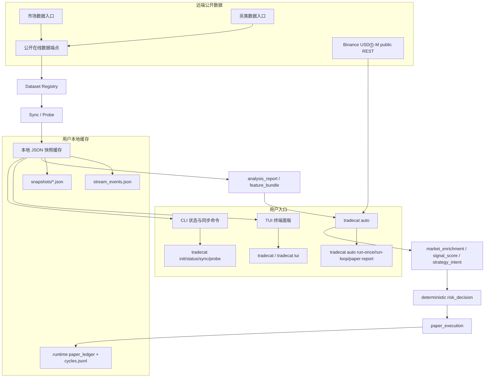

<div align="center">

# TradeCat

用户侧终端面板 + 完整全生命周期本地工作中心：只读 TradeCat 公开数据入口，写入本地 JSON 快照缓存，在终端中浏览市场快照与事件流，并在同一项目内运行 Binance USDⓈ-M 公开行情、确定性信号评分、保守风控、持久化纸面交易 ledger、安全 run-loop 和结构化交易经验沉淀。

[](https://github.com/tukuaiai/tradecat/actions/workflows/ci.yml)
[](https://www.python.org/)
[](LICENSE)

CA：[DexScreener](https://dexscreener.com/bsc/0x8a99b8d53eff6bc331af529af74ad267f3167777)

公开数据入口：
由内置 dataset registry 管理，用户无需手工配置数据源。

社区：
[Telegram](https://t.me/tradecat_community) /
[GitHub](https://github.com/tukuaiai/tradecat)

</div>

---

## 目录

- [定位](#定位)
- [系统架构图](#系统架构图)
- [免责声明](#免责声明)
- [快速开始](#快速开始)
- [一次性请求](#一次性请求)
- [常用命令](#常用命令)
- [TUI 操作](#tui-操作)
- [数据集](#数据集)
- [Agent 分析与自动化生命周期](#agent-分析与自动化生命周期)
- [缓存结构](#缓存结构)
- [配置](#配置)
- [开发与验证](#开发与验证)

> 给 AI 助手的一句话：`请按 https://github.com/tukuaiai/tradecat/tree/develop 的 README 帮我安装并运行 TradeCat。`

## 定位

TradeCat 是一个轻量、可本地运行、可独立分发的用户侧工具，也是本机 Agent 的完整全生命周期工作中心。

它统一做这些事：

1. 从公开在线数据端点读取数据。
2. 把最新内容保存为用户本地 JSON 快照缓存。
3. 用 CLI / TUI 在终端里查看市场快照和事件流。
4. 从 `event_stream` / `anomaly_panel` 读取公开信号，接入 Binance USDⓈ-M 公开行情。
5. 生成确定性 `market_enrichment`、`signal_score`、`strategy_intent`、`risk_decision` 和 paper execution / ledger 报告。
6. 运行 `tradecat auto run-loop` 做安全 watch/paper 轮询、JSONL 审计和纸面仓位生命周期监控。

它当前明确不做这些事：

- 不连接或写入 TradeCat 服务端 PostgreSQL。
- 不使用 SQLite、WAL、本地 SQL 查询层或数据库型后端存储。
- 不需要云端服务账号、私钥、token 或服务端权限。
- 不承担服务端数据生产、采集、修复或发布职责。
- 不读取 Binance API key，不签名请求，不读真实账户，不真实下单；主网/测试网执行必须后续另行实现确定性风控、kill switch 和显式启用。

## 系统架构图



## 免责声明

1. 本项目仅用于技术研究、数据浏览与社区协作交流，不构成投资建议、理财建议或交易建议。
2. 本项目不隶属于任何交易所、基金、做市商或官方组织。
3. 数字资产价格波动剧烈，可能出现大幅亏损甚至归零风险，请自行评估风险并独立决策。
4. 本工具只读取公开在线数据源，不保证第三方数据源、网络、外部数据承载服务、交易所页面或外部链接持续可用。
5. 项目维护者和贡献者不对任何直接或间接损失承担责任，包括但不限于投资亏损、交易损失、第三方服务故障、误用数据或链接跳转风险。

## 快速开始

### 推荐：一键安装

Linux / macOS / WSL / Git Bash：

```bash
curl -fsSL https://raw.githubusercontent.com/tukuaiai/tradecat/v0.1.3/scripts/project/install.sh | sh
tradecat
```

Windows PowerShell：

```powershell
irm https://raw.githubusercontent.com/tukuaiai/tradecat/v0.1.3/scripts/project/install.ps1 | iex
tradecat
```

安装脚本会自动完成：

1. 默认安装当前稳定 tag `v0.1.3`；设置 `TRADECAT_INSTALL_BRANCH=develop` 时改为开发分支通道。
2. 进入仓库内 `scripts/project/` 项目目录并创建项目内 `.venv`。
3. 安装 `tradecat` 命令入口；已有旧文件或失效 symlink 会被替换。
4. 初始化 `.tradecat/cache`。
5. 尝试同步一次公开数据，失败时不阻断安装。
6. 写入 `tradecat` / `tcat` launcher；稳定 tag 安装不自动更新，分支通道安装才按节流策略自动更新。
7. 把 `tradecat-uninstall` 放到用户级命令目录。
8. Linux / macOS / WSL 会把命令目录写入 shell profile；当前会话如果还没生效，可直接运行 `~/.local/bin/tradecat`。

弱网、离线或 CI 环境可跳过安装阶段首次远端同步，只初始化缓存目录；CI 还可以跳过写入用户 PATH / shell profile：

```bash
curl -fsSL https://raw.githubusercontent.com/tukuaiai/tradecat/v0.1.3/scripts/project/install.sh | TRADECAT_INSTALL_SKIP_SYNC=1 TRADECAT_INSTALL_SKIP_PATH_WRITE=1 sh
```

Windows PowerShell：

```powershell
$env:TRADECAT_INSTALL_SKIP_SYNC = "1"; $env:TRADECAT_INSTALL_SKIP_PATH_WRITE = "1"; irm https://raw.githubusercontent.com/tukuaiai/tradecat/v0.1.3/scripts/project/install.ps1 | iex
```

`TRADECAT_INSTALL_SKIP_SYNC=1` 只建议 CI、离线或弱网排障时使用；普通用户不要设置。跳过后首次启动前建议执行 `tradecat sync-all`。

### 开发通道安装

普通用户默认使用稳定 tag。如果你需要跟随 `develop`，显式选择开发通道；这种安装会在
launcher 启动前按 `TRADECAT_UPDATE_INTERVAL_SECONDS` 节流检查远端更新。

Linux / macOS / WSL / Git Bash：

```bash
curl -fsSL https://raw.githubusercontent.com/tukuaiai/tradecat/develop/scripts/project/install.sh | TRADECAT_INSTALL_BRANCH=develop sh
```

Windows PowerShell：

```powershell
$env:TRADECAT_INSTALL_BRANCH = "develop"; irm https://raw.githubusercontent.com/tukuaiai/tradecat/develop/scripts/project/install.ps1 | iex
```

更新策略：

- 稳定 tag 安装默认不自动更新，保证用户入口可复现。
- 分支通道安装会在每次运行 `tradecat` / `tcat` 前按 `TRADECAT_UPDATE_INTERVAL_SECONDS` 做节流检查，默认最多每 1 小时触发一次。
- 分支通道普通启动使用后台更新，不阻塞 TUI；更新完成后下次启动自动使用新版本。
- 如果设置 `TRADECAT_FORCE_UPDATE=1`，launcher 会改为阻塞更新，确认拉到最新版本后再启动。
- 更新失败时默认继续使用本地版本；设置 `TRADECAT_FORCE_UPDATE=1` 后，更新失败会直接退出。
- 设置 `TRADECAT_NO_AUTO_UPDATE=1` 可跳过启动前自动更新。
- 如果你安装的是旧版 launcher，需要重新执行一次上面的一键安装命令，新的启动前自动更新逻辑才会生效。

### 卸载

安装完成后，直接运行：

```bash
tradecat-uninstall
```

Windows PowerShell：

```powershell
tradecat-uninstall
```

也可以不依赖本地安装，直接远程卸载默认安装位置：

```bash
curl -fsSL https://raw.githubusercontent.com/tukuaiai/tradecat/develop/scripts/project/uninstall.sh | sh
```

Windows PowerShell：

```powershell
irm https://raw.githubusercontent.com/tukuaiai/tradecat/develop/scripts/project/uninstall.ps1 | iex
```

卸载会删除：

- TradeCat 安装目录。
- `tradecat` / `tcat` / `tradecat-uninstall` 命令入口。
- 后台 watch 的 pid/log 运行态目录。

卸载不会删除：

- 系统 Python。
- Git。
- uv。
- 用户 PATH 变量。

默认缓存位于安装目录内，会随安装目录一起删除。如需卸载前保留缓存：

```bash
TRADECAT_KEEP_CACHE=1 tradecat-uninstall
```

Windows PowerShell：

```powershell
$env:TRADECAT_KEEP_CACHE="1"; tradecat-uninstall
```

默认安装位置：

| 平台 | 源码目录 | 命令目录 |
|:---|:---|:---|
| Linux / macOS / WSL / Git Bash | `~/.tradecat/app` | `~/.local/bin` |
| Windows PowerShell | `%USERPROFILE%\.tradecat\app` | `%USERPROFILE%\.local\bin` |

可选环境变量：

| 变量 | 说明 |
|:---|:---|
| `TRADECAT_INSTALL_REPO` | 覆盖 Git 仓库地址 |
| `TRADECAT_INSTALL_DEFAULT_REF` | 一键安装未显式设置分支或 ref 时使用的稳定 tag，默认 `v0.1.3` |
| `TRADECAT_INSTALL_REF` | 固定安装 tag/ref；设置后 launcher 不自动更新 |
| `TRADECAT_INSTALL_BRANCH` | 覆盖为分支通道安装，常用 `develop`；设置后 launcher 按该分支自动更新 |
| `TRADECAT_INSTALL_DIR` | 覆盖源码安装目录 |
| `TRADECAT_PROJECT_SUBDIR` | 覆盖仓库内项目子目录，默认 `scripts/project` |
| `TRADECAT_BIN_DIR` | 覆盖命令入口目录 |
| `TRADECAT_PYTHON_VERSION` | 覆盖 Python 版本，默认 `3.12` |
| `TRADECAT_INSTALL_ALLOW_UV_BOOTSTRAP` | 无 Python/uv 时显式允许安装器执行远程 uv bootstrap；默认不静默执行 |
| `TRADECAT_NO_AUTO_UPDATE` | 设为 `1` 时，启动 `tradecat` 前跳过自动更新 |
| `TRADECAT_FORCE_UPDATE` | 设为 `1` 时，启动前更新失败会直接退出 |

如果系统没有 Python 3.12，但已有 `uv`，安装脚本会用 `uv` 托管 Python 3.12。
如果 Python 和 `uv` 都不存在，安装器默认直接失败并提示安全边界；只有显式设置
`TRADECAT_INSTALL_ALLOW_UV_BOOTSTRAP=1` 时才会执行远程 uv bootstrap。仍然需要本机有
`git` 和 `curl`。

Windows Terminal、VS Code Terminal、WezTerm、Alacritty、Kitty 等稳定终端会默认启用交互式 TUI；浏览器 Web 终端、未知 SSH 终端和未知 Windows 控制台会自动降级为静态文本模式，不再抛出 Python traceback。自动降级后会停留并等待 Enter，避免窗口或会话看起来像“闪退”；显式执行 `tradecat tui --plain` 时不等待，适合脚本读取。如需自行测试交互模式，可设置 `TRADECAT_TERMINAL_FORCE_CURSES=1`；如确认未知 Windows 控制台也支持 curses，可设置 `TRADECAT_TERMINAL_ALLOW_WINDOWS_CURSES=1`；如果确认自己的 SSH 终端支持宽字符 curses，也可设置 `TRADECAT_TERMINAL_ALLOW_SSH_CURSES=1`。

### 手动：从源码安装

```bash
git clone https://github.com/tukuaiai/tradecat.git
cd tradecat/scripts/project
python3 -m venv .venv
. .venv/bin/activate
pip install -c constraints.txt -e ".[dev]"

tradecat init
tradecat datasets
tradecat status
tradecat
```

安装后提供三个命令入口：

| 命令 | 用途 |
|:---|:---|
| `tradecat` | 默认直接打开 TUI |
| `tradecat-terminal` | 兼容入口 |
| `tcat` | 短命令别名 |

### 任意目录启动

如果你使用本地虚拟环境安装，可以把命令软链接到 `~/.local/bin`：

```bash
mkdir -p ~/.local/bin
ln -sfn "$(pwd)/.venv/bin/tradecat" ~/.local/bin/tradecat
```

之后可以在任意目录执行：

```bash
tradecat
```

## 一次性请求

不安装、不克隆、不写缓存，直接请求公开数据：

```bash
python3 <(curl -fsSL https://raw.githubusercontent.com/tukuaiai/tradecat/develop/scripts/project/scripts/request.py) event_stream
```

`request.py` 会读取同仓库的 `scripts/project/src/tradecat_terminal/dataset_registry.json`，与安装版使用同一个 dataset 契约；可用 `TRADECAT_REQUEST_REGISTRY_URL` 或 `--registry-url` 覆盖。

Agent 推荐使用 JSON 契约模式：

```bash
python3 scripts/request.py --datasets --format json
python3 scripts/request.py event_stream --format json --limit 5
```

成功 payload 会带 `schema` / `schema_version`，失败 payload 会带稳定
`error.code` / `error.kind` / `error.hint` / `error.retryable`。

常用示例：

```bash
# 列出可用 dataset
python3 <(curl -fsSL https://raw.githubusercontent.com/tukuaiai/tradecat/develop/scripts/project/scripts/request.py) --datasets

# 查看事件流前 20 行
python3 <(curl -fsSL https://raw.githubusercontent.com/tukuaiai/tradecat/develop/scripts/project/scripts/request.py) event_stream --limit 20

# JSONL 输出，方便脚本或 Agent 消费
python3 <(curl -fsSL https://raw.githubusercontent.com/tukuaiai/tradecat/develop/scripts/project/scripts/request.py) market_snapshot --format jsonl --limit 10

# 只看元信息或表头
python3 <(curl -fsSL https://raw.githubusercontent.com/tukuaiai/tradecat/develop/scripts/project/scripts/request.py) market_stats --meta
python3 <(curl -fsSL https://raw.githubusercontent.com/tukuaiai/tradecat/develop/scripts/project/scripts/request.py) anomaly_panel --headers
```

不支持 process substitution 的 shell 可使用：

```bash
curl -fsSL https://raw.githubusercontent.com/tukuaiai/tradecat/develop/scripts/project/scripts/request.py -o /tmp/tradecat-request.py
python3 /tmp/tradecat-request.py event_stream
```

### AI 安装提示词

把下面这段复制给 Claude / ChatGPT / Cursor / Codex：

```text
请帮我安装并运行 TradeCat：

1. 克隆 https://github.com/tukuaiai/tradecat.git
2. 进入仓库内 scripts/project 目录后创建 Python 3.12 虚拟环境
3. 执行 pip install -e ".[dev]"
4. 运行 bash scripts/verify.sh
5. 运行 tradecat init 和 tradecat
6. 如果 tradecat 命令不在 PATH，把 .venv/bin/tradecat 软链接到 ~/.local/bin/tradecat
```

## 常用命令

```bash
# 默认打开终端面板；先读本地缓存，进入后按 tap 独立间隔探测
tradecat

# 初始化缓存目录，默认 TradeCat 项目根目录 .tradecat/cache
tradecat init

# 查看 dataset 和缓存状态
tradecat datasets
tradecat status
tradecat doctor
tradecat doctor --fix
tradecat status --json
tradecat datasets --json
tradecat path event_stream --json
tradecat doctor --json
tradecat doctor --verbose
tradecat doctor --bundle doctor-bundle.json
tradecat doctor --repair

# 首次缓存为空或弱网时
tradecat sync-all
tradecat config set tui_fetch_timeout.event_stream 3
tradecat doctor --sync --timeout 10

# 查看结构化 JSON/JSONL/CSV 固定路径
tradecat path
tradecat path event_stream

# 本地用户配置
tradecat config show
tradecat config set default_lang en
tradecat config set default_dataset event_stream
tradecat config set tui_probe_interval.event_stream 3

# 同步指定 tap 到文件缓存
tradecat sync event_stream
tradecat sync event_stream --timeout 10
tradecat sync market_snapshot

# 同步全部 active dataset
tradecat sync-all
tradecat sync-all --timeout 10

# 单次探测；默认发现变化后写缓存
tradecat probe event_stream
tradecat probe event_stream --timeout 10

# Agent / 自动化只读探测；不写缓存
tradecat probe event_stream --json --no-write
tradecat probe --json --no-write

# 裁剪历史快照；默认只预览，不删除
tradecat prune --max-snapshots 100
tradecat prune market_snapshot --max-snapshots 100 --apply

# 导出当前缓存视图
tradecat export event_stream --format json
tradecat export market_snapshot --format csv --output market_snapshot.csv
tradecat export market_snapshot --format csv --output exports/market_snapshot.csv
tradecat export anomaly_panel --format table --lang en

# 后台持续探测
tradecat watch event_stream --interval 5
tradecat watch --interval 60

# 全生命周期自动化入口：公开行情 + watch/paper，不读 key、不真实下单
tradecat auto market-universe --json
tradecat auto probe-public --json
tradecat auto run-once --mode paper --notional-usdt 12 --json
tradecat auto run-loop --mode paper --notional-usdt 12 --state-path .runtime/service_state.json --ledger-path .runtime/paper_ledger.json --archive-path .runtime/cycles.jsonl --once --json
tradecat auto paper-report --ledger-path .runtime/paper_ledger.json --json

# 自主持续纸面测试服务：循环用实盘公开数据跑 run-loop --once，写入 ledger/archive/log
scripts/start-auto-paper.sh status --json
scripts/start-auto-paper.sh start --json
scripts/start-auto-paper.sh stop --json

# 后台 watcher 生命周期状态；--json 给 Agent / 自动化使用
bash scripts/start.sh status
bash scripts/start.sh status --json
bash scripts/start.sh start --json
bash scripts/start.sh stop --json

# operator-only 重启入口；不作为 Agent 首选入口
bash scripts/start.sh restart --json
bash scripts/watchdog.sh --json

# TUI
tradecat tui
tradecat tui event_stream
tradecat tui --plain
tradecat tui --no-live
tradecat tui --lang en
TRADECAT_LANG=ko tradecat
```

`status` 会显示每个 dataset 的 `ready/initialized/missing` 状态、`latest.*`
文件是否存在、行列数、缓存体积和最近拉取时间；`doctor` 在缓存未同步时给出
warning 和 repair hint，并保留非零退出码给真正的本地缓存错误。`doctor --fix`
只初始化本地目录骨架，不触发远端网络同步；`doctor --repair` 只迁移本地缓存
metadata，不删除快照、不联网；`doctor --verbose` 会显示 settings 健康、cache
migration、最近 typed error 和磁盘水位；`doctor --bundle [PATH]` 生成可公开分享的
诊断 JSON。缺失数据仍按提示执行 `tradecat sync` 或 `tradecat sync-all`。当全部
active dataset 都没有 latest 缓存时，doctor 会明确标记首次空缓存，并给出
`sync-all` 与弱网 timeout 修复命令。需要一键联网修复时，显式执行
`tradecat doctor --sync --timeout 10`。

## TUI 操作

| 操作 | 行为 |
|:---|:---|
| `←/→` | 切换 tap |
| `a/d` 或 `Tab` | 切换 tap |
| `↑/↓` | snapshot tap 切换快照；event_stream 滚动事件 |
| `PgUp/PgDn` | 翻行 |
| `g/G` | 跳到顶部 / 底部 |
| `/` | 搜索当前表格可见数据；搜索会匹配显示值和原始值 |
| `x` | 清除搜索 |
| `n/p` | 选择可见行 |
| `Enter/o` | 打开当前行 URL；无 URL 时打开交易对 Binance Futures 链接 |
| `r` | 重新拉取当前 tap 并写入缓存 |
| `?` | 打开 / 关闭内置帮助页 |
| `l` / `L` | 在中文 / English / 한국어 之间切换 TUI 界面语言；TUI 顶部控制行固定显示 `切换语言 / Switch language / 언어 전환`，防止误切后看不懂如何切回 |
| `q` | 退出 |

渲染规则：

- 多语言只作用于 TUI/CLI 外壳文案、状态栏、帮助页和 dataset 展示名；表格区不翻译列名，避免破坏在线表格原貌。
- 上游数据的广告/链接/元信息行显示在顶部文本区，不进入表格区。
- 表格区顶层表头固定使用在线表格物理列 `A/B/C...`；真实业务表头保留为表格内第一行，便于和 Web 端一一对照。
- 表格作为一个整体渲染，不冻结主键列，也不提供右侧列横向滚动。
- 渲染器按真实内容宽度生成 psql 表格，不做按 tap 的自动缩放、撑满空隙或固定宽度省略。
- 终端窗口只负责裁剪当前可见区域；超长内容要看全，直接扩大终端列数或缩小终端字体。
- 终端窗口或字体缩放后，TUI 会检测尺寸变化并立即重绘，不需要手动按 `r`。
- Windows Terminal / VS Code Terminal / WezTerm 等稳定终端默认进入交互式 TUI；网页 SSH、未知 SSH、未知 Windows 控制台或无 curses 环境会自动切换到 Rich 无边框静态文本模式，避免长边框在终端换行后错位。
- 缓存文件始终保留完整值。

TUI 探针规则：

- 当前焦点 tap 按自己的 interval 前台刷新。
- 非焦点 active tap 默认也会后台保鲜刷新，不需要切过去才更新。
- TUI 启动后立即发起异步 probe；网络慢不会阻塞界面主循环。
- 滚动、选行、hover 只读内存中的当前 view/render cache，不重复读取 JSON 快照。
- 状态栏固定显示语言、缓存状态、远端导出时间、本地拉取时间、探针状态、下次刷新时间和缓存路径。
- 探针失败不会清空界面；状态栏会保留缓存并显示失败原因和恢复建议。
- `event_stream` 使用两列轻量渲染，只渲染时间与内容，避免长文本拖慢交互。
- `event_stream` 当前焦点默认 `interval=3.0s`、`timeout=3.0s`。
- 空缓存状态会显示 cold-start 诊断：`warming` 表示后台首次拉取中，`sync-needed`
  表示需要手动同步，`probe-failed` 表示首次拉取失败但程序仍可继续重试。
- `event_stream` 非焦点默认后台保鲜间隔 `10s`；其他非焦点 tap 默认 `60s`。
- timeout 会被限制为不超过对应 tap 的基础 interval。
- 连续失败自动退避：1 次失败退到 `3s`，2 次退到 `5s`，3 次及以上退到 `15s`；成功后恢复基础 interval。
- 可通过 `TRADECAT_TERMINAL_TUI_BACKGROUND_PROBE=0` 关闭非焦点后台保鲜。

## 数据集

| dataset_key | source | tab | mode |
|:---|:---|:---|:---|
| `market_snapshot` | `market_data` | `全市场快照` | `snapshot` |
| `anomaly_panel` | `market_data` | `异动面板` | `snapshot` |
| `market_stats` | `market_data` | `全市场统计` | `snapshot` |
| `event_stream` | `alternative_data` | `事件流` | `stream` |

`tradecat datasets --json` 会为每个 dataset 输出 `consumption_contract`，
包含字段语义、缺失值策略、时间粒度和质量等级。完整机器契约位于
`src/tradecat_terminal/dataset_consumption_contract.json`，说明文档见
`references/dataset-consumption-contract.md`。

## Agent 分析与自动化生命周期

```bash
tradecat analyze --json
tradecat features --json
```

`analyze --json` 只读取本地最新缓存，不联网、不写缓存，输出
`tradecat.analysis_report.v1`。第一版消费 `event_stream`、`anomaly_panel`
和 `market_stats`，生成观察、候选标的、证据、风险标记和限制说明。

`features --json` 继续只读本地缓存，复用 `analysis_report.v1` 的候选和
证据逻辑，输出 `tradecat.feature_bundle.v1`。它把观察结果按 `symbol`
归一化成可验证事实包，包含 `features[]`、`source_dataset_keys`、
`freshness`、`evidence_ids`、`confidence`、`risk_flags` 和
`limitations`。

它不是交易策略接口：不输出买卖建议、仓位、价格目标、回测或自动执行
语义；`features --json` 也不输出分数、收益预测或排序建议。空缓存时
`analyze --json` 会返回 `error.code=empty_analysis_cache`，`features --json`
会返回 `error.code=empty_feature_cache`；需要先执行：

```bash
tradecat doctor --sync --timeout 10
```

`tradecat auto ...` 是给 Hermes/Agent 调用的本地契约适配层，位于 `src/tradecat_auto/`。
Agent/Hermes 可参考 `resources/agent_market_context/binance/provenance.manifest.json`
中的本地自包含 Binance skill/API 快照，但运行期仍只接收 public/read-only
market context。它从 `event_stream` / `anomaly_panel` 和 Binance USDⓈ-M public REST 构造
`tradecat_auto.market_enrichment.v1`、`signal_score.v1`、`strategy_intent.v1`、
`risk_decision.v1`、`paper_execution_report.v1`、`paper_ledger.v1` 和
`service_cycle.v1`。当前可运行命令：

```bash
tradecat auto market-universe --json
tradecat auto probe-public --json
tradecat auto run-once --mode paper --notional-usdt 12 --json
tradecat auto run-loop --mode paper --notional-usdt 12 \
  --state-path .runtime/service_state.json \
  --ledger-path .runtime/paper_ledger.json \
  --archive-path .runtime/cycles.jsonl \
  --once --json
tradecat auto paper-report --ledger-path .runtime/paper_ledger.json --json
tradecat auto context-audit --input /path/to/agent-market-context.json --json
tradecat auto run-context --input /path/to/agent-market-context.json --mode paper --notional-usdt 12 --json
tradecat auto replay-report --archive-path .runtime/cycles.jsonl --ledger-path .runtime/paper_ledger.json --json
scripts/start-auto-paper.sh start --json
scripts/start-auto-paper.sh status --json
scripts/start-auto-paper.sh stop --json
```

自动化层仍然不是投资建议接口：它只做公开只读行情、确定性评分、保守风控和
paper/watch；不会读取 Binance API key，不会签名请求，不会读取真实账户，也不会真实下单。
Agent-supplied market context 必须先通过 `context-audit` 的 family/endpoint/provenance
allowlist，再用 `run-context` 进入同一套 paper/watch 风控闭环；`replay-report` 只读取本地
JSONL cycle archive 和 paper ledger，生成可复现纸面回放/回测摘要。`.runtime/` 是本地运行态和纸面账本目录，已加入 `.gitignore`，不得提交。

### Snapshot tap

`market_snapshot`、`anomaly_panel`、`market_stats` 是快照型 tap：

- 每次拉取计算完整二维数据 matrix hash。
- hash 不变时不新增快照文件。
- hash 变化时写入一个新的 `snapshots/<time>_<hash>.json`。
- TUI 上下键切换历史快照。

### Event stream tap

`event_stream` 是增量流：

- 每次仍保留最新原始快照。
- 同时按 `时间(北京) + 内容` 生成事件键，写入 `stream_events.json`。
- 重复事件只更新 `seen_count / last_seen_at`。
- TUI 上下键滚动事件列表，不切换批次。

## 缓存结构

结构化 JSON 的固定默认位置：

```text
<TradeCat 项目根目录>/.tradecat/cache
```

在本仓库开发态，固定为：

```text
<repo>/scripts/project/.tradecat/cache
```

Agent 和脚本优先读取：

```text
.tradecat/cache/manifest.json
.tradecat/cache/datasets/<dataset_key>/latest.json
.tradecat/cache/datasets/<dataset_key>/latest.jsonl
.tradecat/cache/datasets/<dataset_key>/latest.csv
```

常用路径：

```text
.tradecat/cache/datasets/event_stream/latest.json
.tradecat/cache/datasets/event_stream/latest.jsonl
.tradecat/cache/datasets/market_snapshot/latest.json
.tradecat/cache/datasets/anomaly_panel/latest.json
.tradecat/cache/datasets/market_stats/latest.json
```

`TRADECAT_CACHE_DIR` 可以覆盖缓存根目录；未设置时一律使用 TradeCat 项目根目录下的 `.tradecat/cache`。`.tradecat/` 是运行时缓存目录，已加入 `.gitignore`，不提交到仓库。

```text
.tradecat/cache/
├── manifest.json
└── datasets/
    ├── market_snapshot/
    │   ├── manifest.json
    │   ├── latest.json
    │   ├── latest.jsonl
    │   ├── latest.csv
    │   └── snapshots/*.json
    ├── anomaly_panel/
    │   ├── manifest.json
    │   ├── latest.json
    │   ├── latest.jsonl
    │   ├── latest.csv
    │   └── snapshots/*.json
    ├── market_stats/
    │   ├── manifest.json
    │   ├── latest.json
    │   ├── latest.jsonl
    │   ├── latest.csv
    │   └── snapshots/*.json
    └── event_stream/
        ├── manifest.json
        ├── latest.json
        ├── latest.jsonl
        ├── latest.csv
        ├── snapshots/*.json
        └── stream_events.json
```

- `latest.json`：AI/Agent 读取的完整结构化数据，包含 source/sync/layout/columns/rows/indexes/stats。
- `latest.jsonl`：一行一条记录，便于 shell、脚本和 Agent 流式消费。
- `latest.csv`：去掉顶部信息和元信息后的干净业务表。
- `snapshots/*.json`：内容 hash 变化时追加保存的历史原始 matrix 快照。

## 配置

用户配置优先使用 `tradecat config` 写入本地 JSON，不需要长期手写环境变量：

```bash
tradecat config show
tradecat config set default_lang en
tradecat config set default_dataset event_stream
tradecat config set cache_dir /path/to/cache
tradecat config set tui_probe_interval.event_stream 3
tradecat config unset default_lang
```

环境变量仍然保留，优先级高于配置文件，适合临时覆盖或脚本运行。

| 变量 | 默认值 | 说明 |
|:---|:---|:---|
| `TRADECAT_SETTINGS_PATH` | TradeCat 项目根 `scripts/project/.tradecat/settings.json` | 用户侧配置文件路径 |
| `TRADECAT_CACHE_DIR` | TradeCat 项目根 `scripts/project/.tradecat/cache` | 本地快照缓存目录 |
| `TRADECAT_PUBLIC_ROOT` | 自动识别当前仓库根 | `tradecat auto` 读取本仓 `scripts/project/scripts/request.py` 时的仓库根覆盖 |
| `TRADECAT_TERMINAL_<DATASET_KEY>_TUI_PROBE_INTERVAL` | 无 | 覆盖单个 dataset 的 TUI live 探针间隔秒数，例如 `TRADECAT_TERMINAL_EVENT_STREAM_TUI_PROBE_INTERVAL=3` |
| `TRADECAT_TERMINAL_TUI_PROBE_INTERVAL` | 空 | 全局覆盖 TUI live 探针间隔秒数；未设置时读取 dataset 契约，`event_stream` 默认 `3.0`，其它 tap 默认 `10` |
| `TRADECAT_TERMINAL_<DATASET_KEY>_TUI_FETCH_TIMEOUT` | 无 | 覆盖单个 dataset 的 TUI live 拉取超时秒数，例如 `event_stream` 默认 `3.0` |
| `TRADECAT_TERMINAL_TUI_FETCH_TIMEOUT` | 空 | 全局覆盖 TUI live 探针单次数据拉取超时秒数；未设置时 `event_stream` 默认 `3.0`，其它 tap 默认 `2.0` |
| `TRADECAT_TERMINAL_TUI_DEFAULT_DATASET` | `event_stream` | 无参数 `tradecat` 默认打开 dataset |
| `TRADECAT_LANG` | 系统 locale；无法识别时为 `zh` | TUI/静态兼容输出语言；可选 `zh` / `en` / `ko` |
| `TRADECAT_TERMINAL_NO_PAUSE` | 空 | 设为 `1` 时，自动静态兼容输出后不等待 Enter；用于脚本、CI 或自动化终端 |
| `TRADECAT_CACHE_MAX_SNAPSHOTS` | 空 | `tradecat prune` 未传 `--max-snapshots` 时读取；空表示不启用裁剪 |
| `TRADECAT_CACHE_COMPRESSION` | `none` | 新快照压缩方式；可选 `none` / `gzip`，默认不压缩 |
| `TRADECAT_CACHE_WARN_BYTES` | `104857600` | doctor 磁盘水位 warning 阈值，默认 100MB |
| `TRADECAT_LOCAL_STATE_LOCK_TIMEOUT` | `10` | 本地 cache/settings 文件锁等待秒数 |
| `TRADECAT_UPDATE_INTERVAL_SECONDS` | `3600` | launcher 启动前后台自动更新的节流间隔秒数；`0` 表示每次启动都触发后台更新 |
| `TRADECAT_NO_AUTO_UPDATE` | 空 | 设为 `1` 时跳过 launcher 自动更新 |
| `TRADECAT_FORCE_UPDATE` | 空 | 设为 `1` 时启动前阻塞更新，失败则退出 |
| `TRADECAT_INSTALL_DEFAULT_REF` | `v0.1.3` | 一键安装未显式设置分支或 ref 时使用的稳定 tag |
| `TRADECAT_INSTALL_REF` | 空 | 固定安装 tag/ref；设置后 launcher 不自动更新 |
| `TRADECAT_INSTALL_ALLOW_UV_BOOTSTRAP` | 空 | 设为 `1` 时允许安装器在无 Python/uv 环境下执行远程 uv bootstrap |
| `TRADECAT_INSTALL_BRANCH` | 空 | 覆盖为分支通道安装，常用 `develop`；设置后 launcher 按该分支自动更新 |
| `TRADECAT_INSTALL_SKIP_SYNC` | 空 | 设为 `1` 时一键安装只初始化缓存目录，跳过安装阶段首次远端同步；用于 CI、弱网或离线安装 |
| `TRADECAT_INSTALL_SKIP_PATH_WRITE` | 空 | 设为 `1` 时一键安装不写用户 PATH / shell profile；用于 CI 或临时安装测试 |
| `TRADECAT_REQUEST_REGISTRY_URL` | GitHub develop registry | 一次性请求脚本读取的 dataset registry JSON |
| `TRADECAT_TERMINAL_RUNTIME_DIR` | `~/.tradecat-terminal/run` | 后台 watch pid/log 目录 |
| `TRADECAT_TERMINAL_WATCH_INTERVAL` | `60` | 后台 watch 间隔秒数 |
| `TRADECAT_TERMINAL_WATCH_DATASET` | 空 | 为空 watch 全部 active dataset |
| `TRADECAT_TERMINAL_WATCH_NO_WRITE` | 空 | 设为 `1` 时后台 watch 只 dry-run 探测，不写缓存；主要用于测试 |

## 开发与验证

```bash
bash scripts/bootstrap-dev.sh
cd scripts/project
./.venv/bin/pytest -q -p no:cacheprovider tests/test_payload_schema_validation.py
bash scripts/verify.sh
PYTHONPATH=src ./.venv/bin/python scripts/validate_data_contract.py --remote --timeout 10
PYTHONPATH=src ./.venv/bin/python scripts/validate_dataset_consumption_contract.py
bash ../../scripts/security-scan.sh
bash ../../scripts/supply-chain-audit.sh
```

不使用根脚本时，也可以在 `scripts/project/` 内手动创建 `.venv` 并执行
`pip install -c constraints.txt -e ".[dev]"`。

CI 会执行：

- 根边界门禁：禁止根目录重新出现项目源码、安装脚本、卸载脚本或 `assets/`。
- 运行态文件门禁：`.venv/`、`.tradecat/` 等缓存和虚拟环境不得进入仓库。
- Secret scan：治理与调试文档入库后，CI 使用 Gitleaks 阻断凭证误提交。
- Supply-chain audit：CI 使用 pinned `pip-audit` 检查 Python 依赖漏洞。
- Data contract：CI 校验内置 dataset registry，并拉取公开 Google Sheets CSV
  做表头和数据行 smoke。
- Published installer smoke：push 后 CI 会直接执行 `v0.1.3` 的
  `raw.githubusercontent.com` 安装入口，并断言默认 `event_stream` 缓存已预热。
- Ruff lint。
- Pytest。
- Shell 语法检查。

`AGENTS.md`、`DEBUG.md`、`DEBUG.archive.md` 是随仓库提交的治理与调试记忆，
必须保持公开安全，不得包含凭证、缓存内容或私密环境变量。
